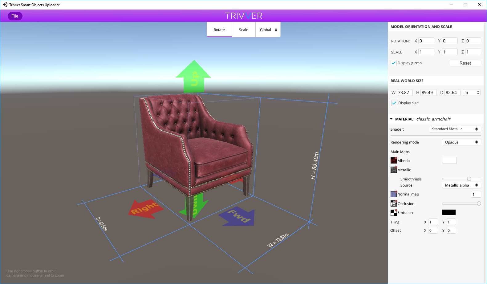

# Branded asset editor

Asset editor is a standalone application used for prepare branded assets for upload to the server.  
With this app you can import models, set models size, orientation, set up materials and save the result as tbso file - our special file format that stores all need information for all supported platforms.  
Then you can upload that tbso file to the server in the advertiser dashboard.

Asset editor has simple enough interface: 

**Importing files:**  
Right now editor supports obj format. To import obj file go to File-&gt;Import obj command. After you select the file you will get small Obj import options popup.

|  |  |
| :--- | :--- |
| Import normals | Import normals from file or calculate them automatically. |
| Calculate tangents | If your model is going to use normal maps, this option should be checked. |
| Scale | Scale factor. |

Now, after model is imported, you can adjust it's orientation, size, set up materials.

In the top of viewport there is tools panel where you can choose to rotate or scale your object, and specify local or global space.  
On the right side there is main panel. There are several rollouts:

**Model orientation and scale**  
In this rollout you can set orientation of the model \(rotation in degrees\) and scale in generic units.  
_Display gizmo checkbox_ enables/disables orientation gizmo in the editor.

In Trivver system all assets have simple orientation system to allow advertiser's assets to appear correctly orientated in games. For example, let's take the model in the picture above. Advertiser rotated armchair, so it's front corresponds to blue **Fwd** array. While some developer that would like to place AdSpot for armchair in his game can see the same orientation arrows of the AdSpot. So, he turns the AdSpot as he want, and the system will place armchair in the game with correspondent orientation, defined by advertiser and developer.

After the game is running and armchair is loaded it will be placed in the blue AdSpot volume and orientated according to orientation gizmo arrows.

**Real world size**  
In general all assets and scenes are provided with real world size. While some of 3d modeling packages can export models in different scale, advertiser is responsible to set proper size in the Asset editor before saving and uploading it to the server.  
With help of **Real world size** rollout advertiser can set the size of his model withe ease. Note that it preserves model proportions, so, it is enough to set the size only by one axis - other will be set automatically.  
W, H, D - are width, height and depth accordingly. You can specify in what units you would like to set the size \(meters, centimeters, inches or feet\).  
_Display size checkbox_ enables/disables orientation gizmo in the editor.

**Material rollouts**  
Next there are material rollouts, that show all the materials contained in the model and allows to edit and set it properly.  
All the parameters in the material rollout are translated from Unity engine and fully mimics Unity editor functionality with slight simplification. So, for more info about materials, please refer to Unity engine docs area:  
[Unity materials](https://docs.unity3d.com/Manual/StandardShaderMaterialParameters.html)

