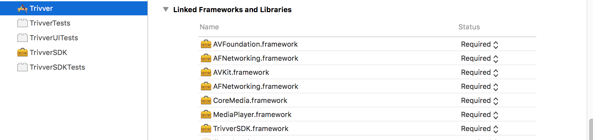
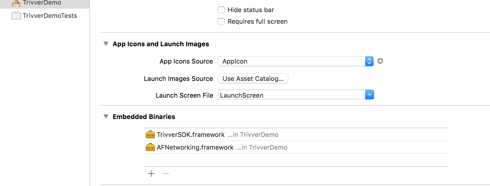

# Installing IOS SDK

## I. CocoaPod
Pod Trivver SDK.

`pod 'TrivverSDK'`

## II. Manual Installing
### Dependencies
* **AFNetworking**. Download from here: 
[https://github.com/AFNetworking/AFNetworking/releases/tag/3.1.0](https://github.com/AFNetworking/AFNetworking/releases/tag/3.1.0)
* Trivver SDK Framework
* IOS 8.0 and above

### Setup
* Add require native framework

* Add embedded binaries

