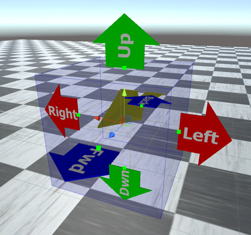
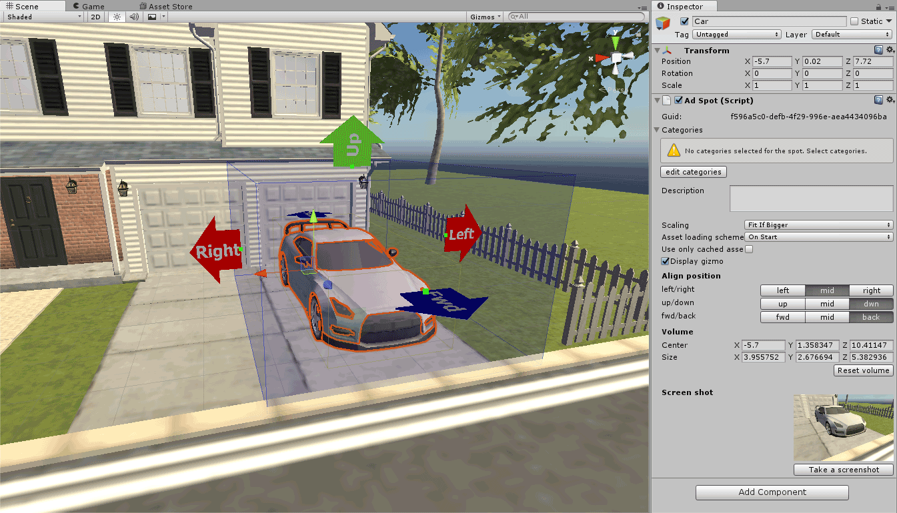
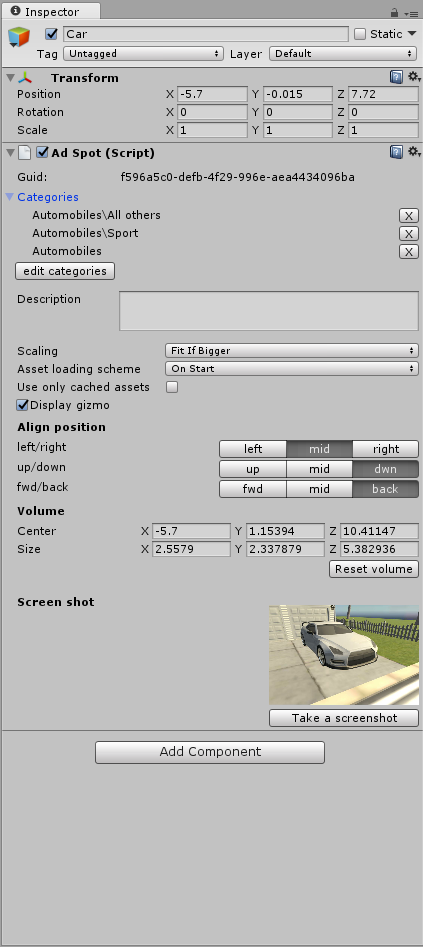
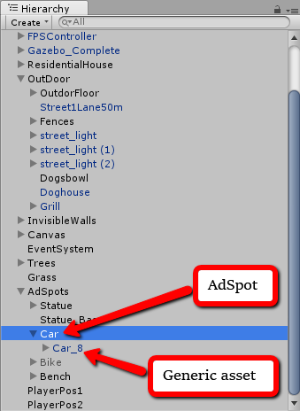

AdSpot is a center of Trivver Unity SDK. In general it is a place for ads - an area in your game where you want [branded asset](xref:unity-branded-asset-term) to be loaded and displayed. AdSpot defines which [branded asset](xref:unity-branded-asset-term) will be loaded in it (by Categories) and how this asset will be positioned, aligned and scaled (if needed).  
In AdSpot properties you define Categories that will define what assets are going to be loaded in it.  
When you create new AdSpot you will see blue cube called “AdSpot Volume”. It shows the volume that defines maximum size of the downloaded branded asset. Also there are arrows with labels that shows direction  of the spot. For example if you place spot for TV you place it on the wall with forward direction looking from the wall.  
You can adjust this Volume by dragging green handles or in the inspector menu. In general it is very similar to setting size of Box Collider in Unity.  
AdSpot can be created via Trivver menu in two ways:  
**Create AdSpot** - create new AdSpot with small cube as [generic asset](xref:unity-generic-asset-term). It is supposed that you will replace that cube with your own model at later time.  
**Create AdSpot for selected object** - create AdSpot based on selected object, i.e. AdSpot will be placed, oriented and scaled to fit selected object size. And then this object will be set as a child of the created AdSpot.

If you delete child of the AdSpot it becomes "empty". Yellow plane gizmo displays that. You have to add your own model (called [generic asset](xref:unity-generic-asset-term)) to AdSpot that will be shown in case if there is no suitable [branded asset](xref:unity-branded-asset-term) on the server or there is any problems with network. This model is called [generic asset](xref:unity-generic-asset-term).  
To add [generic asset](xref:unity-generic-asset-term) to AdSpot you have to add this asset to your scene as a child of the AdSpot. 
When branded asset is loaded generic asset is replaced by it.  
Select AdSpot to see all it's properties in the inspector.
> [!NOTE]
> AdSpot сan only have one child. If there is more than one child in AdSpot it will not work properly.

| Property              | Description                                                                                                                                                                                                                                                                                                                                                                                                                                                                             |
|-----------------------|-----------------------------------------------------------------------------------------------------------------------------------------------------------------------------------------------------------------------------------------------------------------------------------------------------------------------------------------------------------------------------------------------------------------------------------------------------------------------------------------|
| Guid                  | AdSpot unique identifier used by the Trivver system. It is generated when you create or duplicate AdSpot.                                                                                                                                                                                                                                                                                                                                                                               |
| Categories            | AdSpot Categories define what [branded asset](xref:unity-branded-asset-term) will be loaded from the server. To assign/remove categories yoo have to press "Edit" button below Categories control. You may define as many categories as you like to describe more precisely what object you want to be loaded into the spot. For example: Vehicle, Car, Cabriolet, sport car                                                                                                                                                                                   |
| Description           | Short description of the AdSpot.                                                                                                                                                                                                                                                                                                                                                                                                                                                        |
| Scaling               | After loading [branded asset](xref:unity-branded-asset-term) there might be situation that it is bigger than AdSpot Volume. In this situation AdSpot will rescale branded asset according to this parameter.   <ul> <li> **Fit if bigger** - branded asset will be resized only if it is bigger than AdSpot Volume. The asset will be proportionally scaled down while it is fit into the Volume. If the asset is smaller than AdSpot Volume it will stay with original size. </li> <li> **Fit Always** - branded asset will always be re-scaled to fit the volume. So, if for example downloaded asset is smaller than volume it will be scaled up to fit the volume. </li> </ul>                              |
| Asset loading scheme  | <ul> <li> **OnStart** - asset will be loaded to the AdSpot on it’s Start function automatically when the scene loaded.  </li> <li> **Manually** - after level loading AdSpot won’t request any [branded asset](xref:unity-branded-asset-term) until @Trivver.AdSpot.LoadBrandedAsset is called for this spot. </li> <ul>                                                                                                                                                                                                               |
| Use only cached assets | Used when `OnStart` asset loading scheme is used. AdSpot will load asset only if that asset was cashed in #Asset pool so it can be loaded and displayed instantly.                                                                                                                                                                                                                                                                                                                        |
| Display gizmo         | Shows/Hides AdSpot gizmo (blue box with arrows)                                                                                                                                                                                                                                                                                                                                                                                                                                         |
| Align position        | Align position matrix defines two things: first it defines where the pivot point of the AdSpot is placed. Second it defines how #branded asset is aligned within the AdSpot.For example if you set matrix to mid, mid, back - pivot point of AdSpot will be place in the center of bottom face of AdSpot Volume.                                                                                                                            |
| Volume                | AdSpot Volume in numbers. This is absolute size value in world units. If you somehow scaled AdSpot, the size of the volume will be recalculated.                                                                                                                                                                                                                                                                                                                                        |
| Reset volume          | Set the Volume size as the size of [generic asset](xref:unity-generic-asset-term)                                                                                                                                                                                                                                                                                                                                                                                                                                 |
| Take screenshot       | For more convenient managing of AdSpots on the server or in AdSpot browser (upcoming feature) you can create screenshots for each AdSpot. All screenshots are saved in special Trivver folder and can be removed by developer at any time without any harm to the system. Because in Unity it is hard to catch AdSpot deletion in the editor, screenshots are not deleted if you delete AdSpot. To remove unused screenshots you can use “Delete unused previews” tool in Trivver menu. |