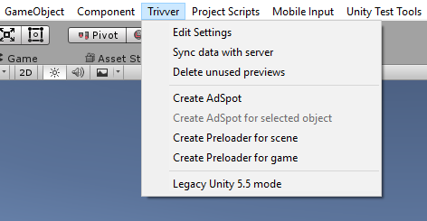

After import you have Plugins/Trivver folder. And new ‘Trivver’ item in the Unity main menu.

  

Menu item | Description
----------|------------
Edit settings | Open Trivver settings in the inspector. For more info see [sdk set up section](xref:unity-setup)
Sync data with server | Open AdSpot synchronization dialog. This item is enabled only if you are logged in as a developer in Trivver Settings. For more info see [Synchronization section](xref:unity-sync)
Delete unused previews | Delete unused preview images from ```Assets/Trivver/Editor/AdSpotScreenshots/``` folder.
Create AdSpot | Create empty AdSpot in currently opened scene.
Create AdSpot for selected object | Create new AdSpot in place of the selected object and place this object in the created AdSpot.
Create Preloader for scene | Add scene preloader in to currently opened scene. For more info see [Asset preloading section](xref:unity-preloading)
Create preloader for game | Add Game preloader in to currently opened scene. For more info see [Asset preloading section](xref:unity-preloading)
Legacy Unity 5.5 mode | Use this option if you are using Unity 5.5 version. It disables some features available only in Unity 5.6 and above.