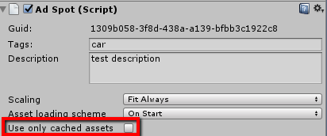
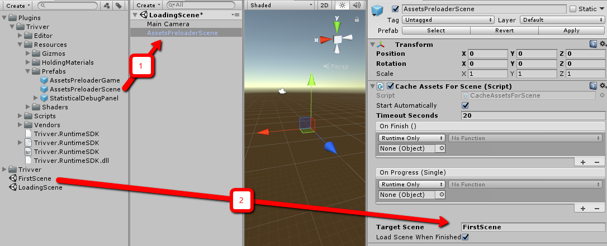

There are few options how [branded assets](xref:branded-asset-term) can be loaded to [AdSpot](xref:unity-adspot-term):
- (Default) [AdSpot](xref:unity-adspot-term) automatically starts loading asset at ```AdSpot.Start()```.
- Loading must be triggered manually by @Trivver.AdSpot.LoadBrandedAsset call.

It is not a secret that loading of 3d models and textures requires CPU time. We do our best to reduce this load,
but some developers do not trust 3rd party components, especially in such thin place as performance.
For this case, we introduced the opportunity to pre-load [branded assets](xref:branded-asset-term) before game / scene starts.

We have @Trivver.TrivverSDK.AssetPool, it holds all loaded assets cache. Every time [AdSpot](xref:unity-adspot-term) requires branded asset, it requests it from AssetPool. 

And depending on [AdSpot](xref:unity-adspot-term) `Use only cached assets` option, asset will be requested from server (or not):



if `Use only cached assets` is checked and AssetPool does not contain requested [Asset](xref:branded-asset-term) - it will never be loaded for that [AdSpot](xref:unity-adspot-term).

Thus if you don't want [Asset](xref:branded-asset-term) loading occur during game play. It is possible to do it
at game or scene loading, by simple pre-loading assets to AssetPool. Next time [AdSpot](xref:unity-adspot-term) will request [Asset](xref:branded-asset-term) -- it will be already loaded. 

## Assets Pre-loader



1. Create ```AssetsPreloaderScene``` from prefab (or add `Cache Assets for scene` to existing `GameObject`)
2. Set Target Scene field, name of next scene. 
3. Set timeout.

Result: After scene run -- asset loading will be triggered for all [AdSpots](xref:unity-adspot-term) which have been synced from `FirstScene`. When loading will be finished -- component will Load next scene.

### Fields description

| Field                     | Description                                                                                                                          |
|---------------------------|--------------------------------------------------------------------------------------------------------------------------------------|
| Start Automatically       | Start pre-loading at MonoBehavior.Start(). If it is not checked -- loading can be started by `CacheAssetsForScene.Startpreloading()` |
| Timeout Seconds           | It is possible to restrict maximum loading time.                                                                                     |
| On Finish                 | Allows to subscribe on pre-loading finish.                                                                                            |
| On Progress               | Subscribe on this event if it is required to track loading progress.                                                                 |
| Target Scene              | Name of scene which will be loaded after pre-loading.                                                                                 |
| Load Scene When Finished  | Load `Target Scene` when pre-loading will be finished.    |

> [!NOTE]
> It is worth to mention if pre-loading will fail it will also be considered as finish, and it will trigger OnFinish event and
> start scene loading. 

> [!NOTE]
> `Use only cached assets` helps to avoid second loading attempt at gameplay, if pre-loading was interrupted.

## Pre-loading from your code

- Write own component based on examples:

    ```
    Scripts/Examples/CacheAssetsByUidExample.cs
    Scripts/Examples/CacheAssetsExample.cs
    Scripts/Examples/CacheAssetsForGameExample.cs
    Scripts/Examples/CacheAssetsForSceneExample.cs
    ```
- Use helper functions from AssetPool:
    - @Trivver.IAssetPool.CacheAssetsForGame
    - @Trivver.IAssetPool.CacheAssetsForGame(System.Action,Trivver.OnInterruptedHandler,System.Action{System.Single})
    - @Trivver.IAssetPool.CacheAssetsForScene(System.String)
    - @Trivver.IAssetPool.CacheAssetsForScene(System.String,System.Action,Trivver.OnInterruptedHandler,System.Action{System.Single})
- Manually pre-load [asset](xref:branded-asset-term) for each [AdSpots](xref:unity-adspot-term) using AssetPool
    - @Trivver.IAssetPool.CacheAssetsForAdSpots(System.Collections.Generic.IEnumerable{System.String})
    - @Trivver.IAssetPool.CacheAssetsForAdSpots(System.Collections.Generic.IEnumerable{System.String},System.Action,Trivver.OnInterruptedHandler,System.Action{System.Single})
    - @Trivver.IAssetPool.CacheAssetsForAdSpots(System.Collections.Generic.IEnumerable{Trivver.SyncedAdSpotInfo},System.Action,Trivver.OnInterruptedHandler,System.Action{System.Single})

 