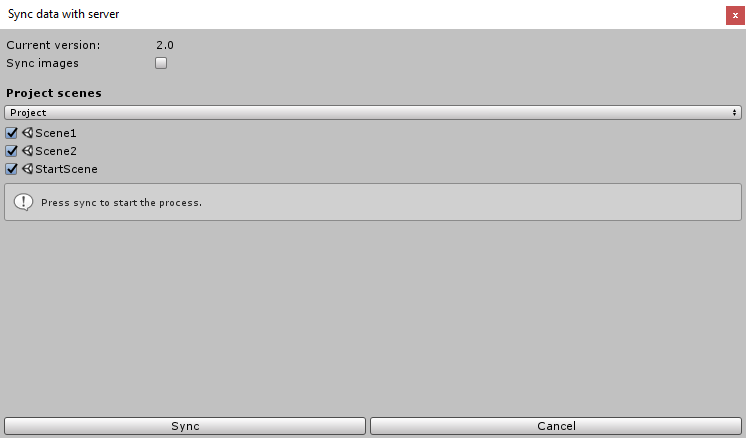

After [AdSpots](xref:unity-adspot-term) and [Trivver settings](xref:unity-settings-term) are set up properly you have to make Synchronization. This process will collect data about all spots in your project validate it (check if there are any spots without categories and all guid's are unique) and send to the server. After this process you can see all your spots in the Developer Dashboard.  

> [!NOTE]
> You have to make synchronization each time you:
> * Add new/delete AdSpots.
> * Modifying categories or description of existing AdSpots.
> * Changing scenes names or moving scenes to another folder. 

Synchronization window can be accessed via Trivver menu or in the Trivver Settings by pressing Sync data button.

> [!NOTE]
> To be able to make synchronization, you have to be logged in in Trivver Settings.

In this window you can see a list of scenes of your project. You can choose to show only scenes from build settings or from overall project. Near each scene there is a checkbox that allows to exclude/include scenes from synchronization.

| Property   | Description|
|------------|------------|
| Current version   | Current game version. Synchronization will be associated with this version. This parameter is set from Trivver Settings. For more info see [Versions and publishing section](xref:unity-versions-term) |
| Sync images       | If true AdSpot previews will be uploaded to the server. If you changed AdSpots and didn't change previews you can uncheck this toggle to save sync time. |
| Project scenes    | <ul> <li> Project - scene list will show all scenes from the project. </li> <li> Build settings - scene list will show only scenes from build settings. </li> </ul>     |
| Sync              | Start synchronization.|

While the synchronization Trivver opens all specified scenes and collects all adSpots data and then sends it to the server. So, before you start the process, make sure that you saved all changes in currently opened scene.