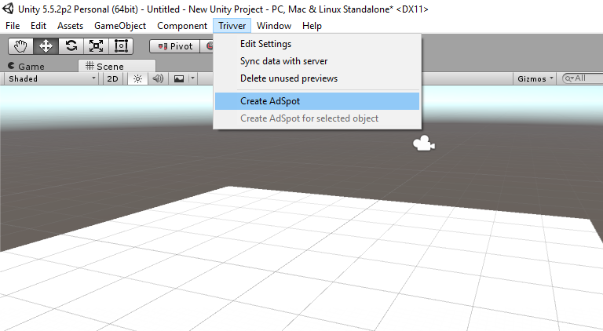
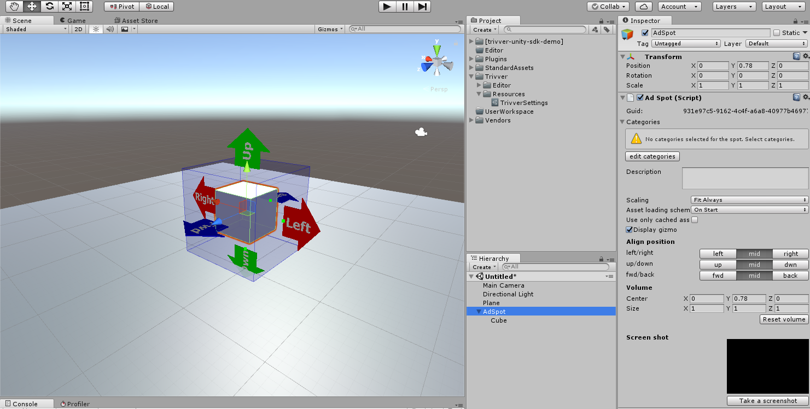
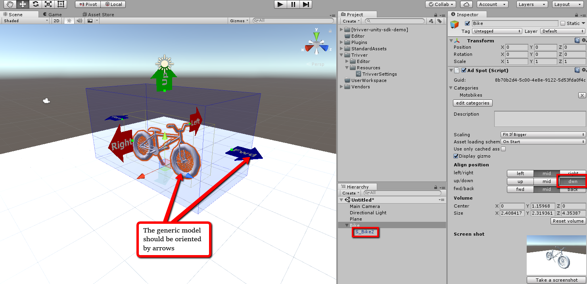
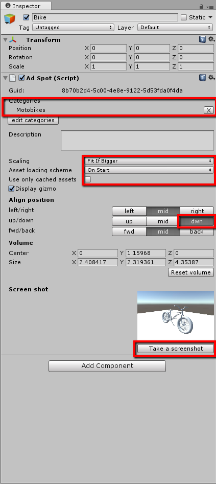

## AdSpots

[!include]  

 

**To create AdSpot:**  
Choose: ‘Trivver’ -> ‘Create AdSpot’  

  

A new object with [AdSpot](xref:unity-adspot-term) component will be created:  
  

* Set up ‘Align position’ options. Align position matrix is used for that. It defines aligning of the object inside [AdSpot](xref:unity-adspot-term) Volume (blue box) and AdSpot pivot point position. In case of bike shown on image below you’d want pivot point to be at the center of [AdSpot](xref:unity-adspot-term) bottom.  
* Set desired position and orientation of the AdSpot. Colored arrows shows directions of the AdSpot.  
* Adjust [AdSpot](xref:unity-adspot-term) Volume size by dragging green handles. It is very similar to setting size of Unity Box Collider. This volume defines maximum size of downloaded branded asset. 
* Now add child object to the AdSpot. In Trivver system this object is called [generic asset](xref:unity-generic-asset-term). It means that this is the model that is going to be shown in [AdSpot](xref:unity-adspot-term) by default, when there are no any branded asset available on the server by some reason. (See the image below) Keep in mind that all AdSpots must have generic objects as a child to work properly in the system.
* Rotate the model so it’s forward direction corresponds [AdSpot](xref:unity-adspot-term) forward direction (i.e. blue arrow with fwd label). Also you can scale your model so it fits nicely in your scene.  

The final result:
  

 
Select corresponding categories for your [AdSpot](xref:unity-adspot-term); categories determine which object should be downloaded from the server. You can select several categories. For this example we enter select one category ‘Motobikes’.  This will allow the system to load all bikes to our AdSpot.
For now uncheck ‘Use only cached asset’, set ‘Asset loading scheme’ to ‘On Start’ and ‘Scaling’ set to ‘Fit if bigger’. For more details see [AdSpot](xref:unity-adspot-term) section of this documentation.  
Take a screenshot for this AdSpot.  

Here is the example of a final setup:  
 