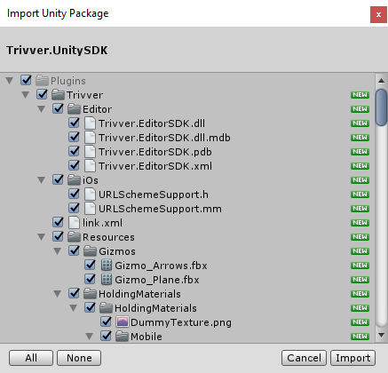
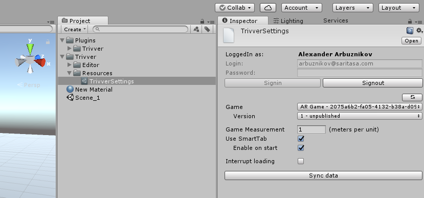

## Installing Unity SDK

**1. Download unity package at Trivver developers dashboard.**  

**2. Import Unity SDK Plugin in to your project.**  
Choose: ‘Assets’ -> ‘Import Package’ -> ‘Custom Package …’
Select Trivver sdk package file.  
Following pop-up window should appear:  
  

Press ‘Import’.  
 
[!include]
 

**3. Select ‘Edit Settings’ menu item.**  
The inspector will show ”TrivverSettings”. Also this step will create second folder at ``/Assets/Trivver path. ``
In this folder Trivver stores project related files, such as game uid, AdSpots list, screenshots and more. So, basically trivver is located in two folders: one in the plugins folder - Trivver plugin itself, and one in the assets folder - Trivver settings.

