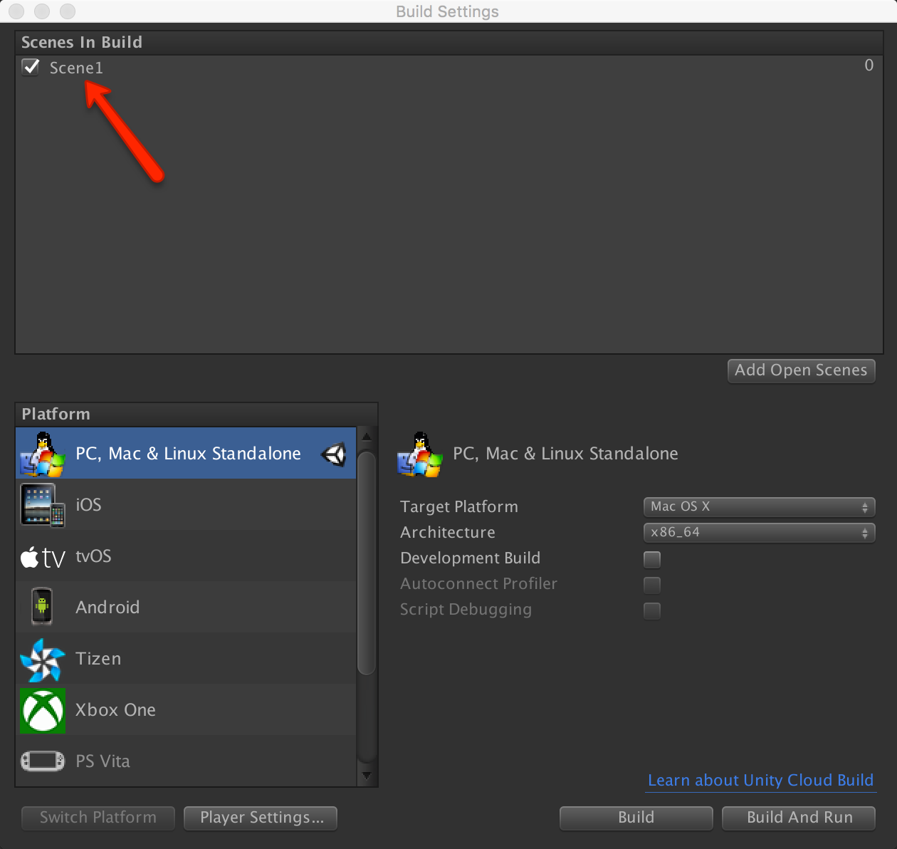
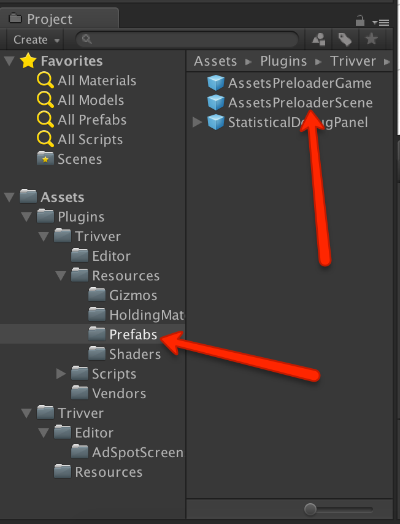
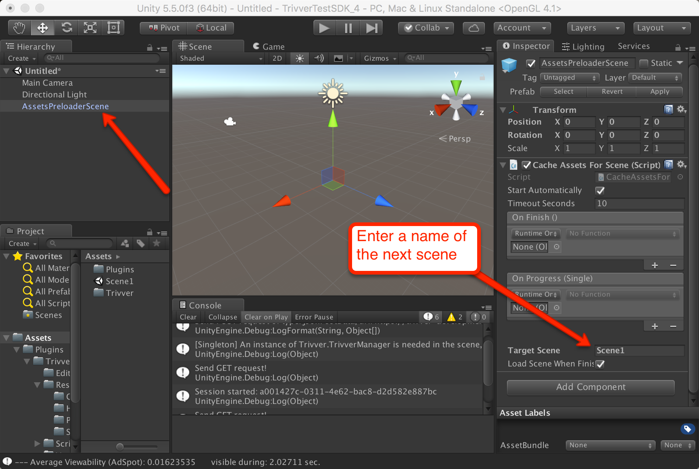
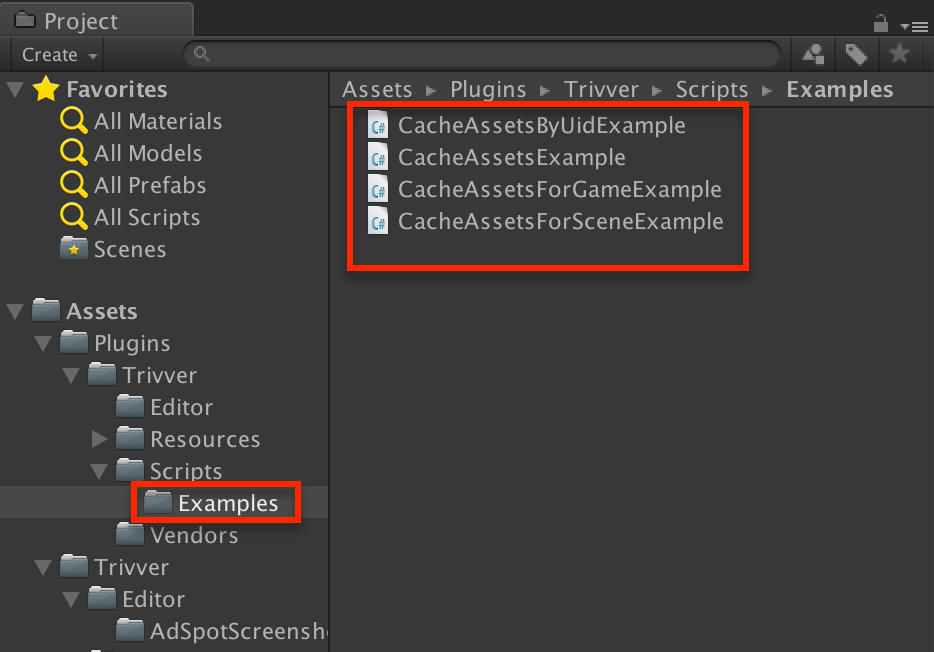

## Pre-loading of Branded Assets

[!include]

## How to
**Add your current scene to the build settings.**  
Save your current scene and add the scene to Build Settings if it was not done before.
  

**Create a new scene for preloading.**  
Create new empty scene and add [Pre-loading](xref:unity-preloading-term) prefab to the scene.  
In the ‘Project’ tab find `AssetsPreloaderScene prefab` that was supplied together with SDK:  
  

Put this prefab into your new scene.  
In the Inspector enter name of the scene that was saved in step 7:  
  

**Run the game.**  
Run the game (while you are in [Pre-loading](xref:unity-preloading-term) scene), and the ‘AssetsPreloaderPrefab’ prefab will pre-load(cache) assets for Scene1. After [Pre-loading](xref:unity-preloading-term) is done Scene1 will be loaded with branded asset already in AdSpot.  

**Additional notes.**  
Instead of using prefabs you can implement [Pre-loading](xref:preloading) directly in your code. You can find examples in a folder located at ‘Assets/Plugins/Trivver/Scripts/Examples’:  
  
