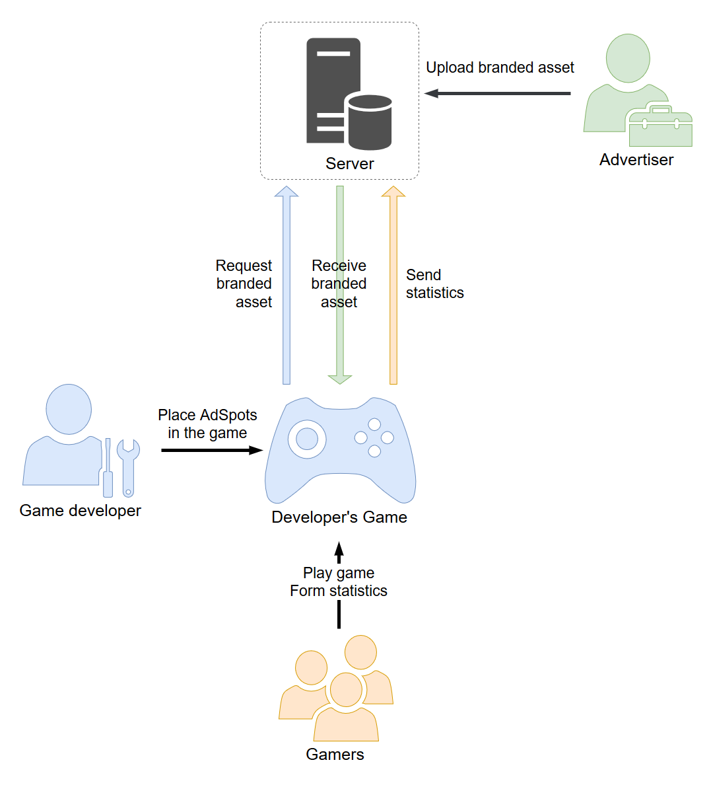
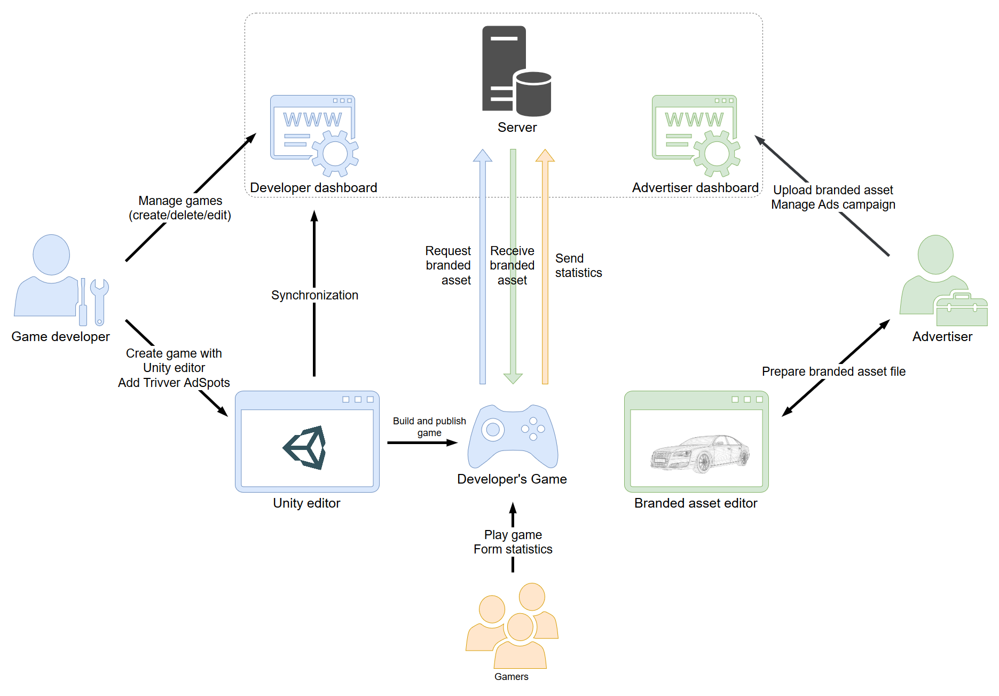

## Trivver Unity SDK

In Trivver system there are basically 5  participants: 
* Developer
* Advertiser
* Game end-user (gamer)
* Trivver server
* Developer’s game

**Advertisers** provide [branded assets](xref:unity-branded-asset-term) i.e. 3d models that represent advertisable products, for example 3d model of branded TV or a car of some popular brand. 

**Developers** using Trivver tools place in their games special entities called [AdSpot](xref:unity-adspot-term) that are basically a place where [branded asset](xref:unity-branded-asset-term) will be loaded.

**Developer’s game** at runtime requests branded assets from the server and after successful download places it at corresponding [AdSpot](xref:unity-adspot-term).

**Gamers** can see downloaded at runtime [branded assets](xref:unity-branded-asset-term) while playing the game. Trivver will collect branded assets viewability statistics and send it to the server. From this statistics system calculates advertiser’s charges and developer’s revenue.

**Server** stores [branded assets](xref:unity-branded-asset-term) and gives them to the game as it requests it. 

[AdSpots](xref:unity-adspot-term), placed by the developer in the game, and branded assets, uploaded to the server by advertisers has parameter called **Categories**. Categories describe what object is.
So, developer while placing [AdSpot](xref:unity-adspot-term) in his game assigns to that spots categories, telling the Trivver system what assets should be loaded in that spot. For example “vehicle, car”.  
And advertiser in his turn assigns categories to his branded asset.  
When a game requests from the server [branded asset](xref:unity-branded-asset-term) for certain [AdSpot](xref:unity-adspot-term) it provides AdSpot’s categories and the server choose branded asset by corresponding category and send it back to the game.  

This was a quick outline of the system. Now let’s take more close look at the system.

### Closer look

As mentioned above advertisers provide [branded assets](xref:unity-branded-asset-term) i.e. 3d models that represent advertisable products, for example 3d model of branded TV or a car of some popular brand. 
First advertiser prepares his model with Trivver standalone app called Branded Asset editor. In this editor he can adjust size and orientation of the model.

>[!NOTE]
>All models in Trivver system are in real world size. Advertisers and developers can preview direction of model by colored arrows.  

After preparation advertiser saves his model in our special file format and uploads this file to the Trivver server via Advertiser dashboard.  
After upload is done advertiser assigns categories to his branded asst that describes what his asset is. Later games that use Trivver will request branded assets from the server and server will decide what asset should be returned based on maximum categories matching. Also advertiser via his dashboard manage his ad campaigns.  

Now let’s take a look at developer side.  
First of all you, as a developer, have to be registered on Trivver website. After registration you can add new games to the Trivver system via developer dashboard and manage them.  
After adding new game in the dashboard, you proceed to with Trivver Unity SDK.

Next you import Trivver SDK package to your project. After SDK import there will be a new menu item called “Trivver”. There are all Trivver related tools that you are going to need while working with Trivver.  
But first you have to properly set up Trivver SDK via [Trivver settings](xref:trivver_settings). You can read in detail how to do this in [Trivver Settings](xref:trivver_settings) section.

After SDK setup you are going to create special entity called [AdSpot](xref:unity-adspot-term). AdSpot is a volume that defines where and how downloaded branded asset should appear. See [AdSpot section](xref:unity-adspot-term) for more info about this.  
Place and set up AdSpots in all necessary scenes in the project.  
After you do this you have to synchronize your game with server. While this process SDK sends data to Trivver server. The sent data  is a list of all AdSpots in the game with all info about this spots. After synchronization you can see all AdSpots from your game in the developer’s dashboard. For more information see [Synchronization](xref:unity-sync) section.
When synchronization is done you can run the game and see Trivver in Action.

