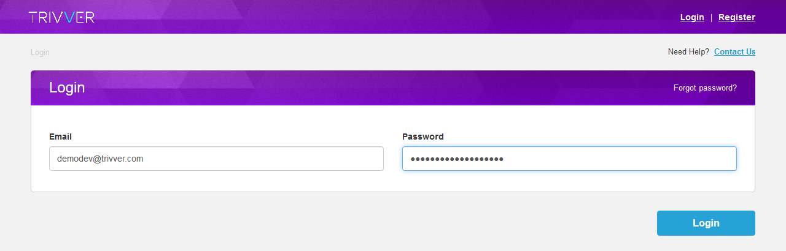
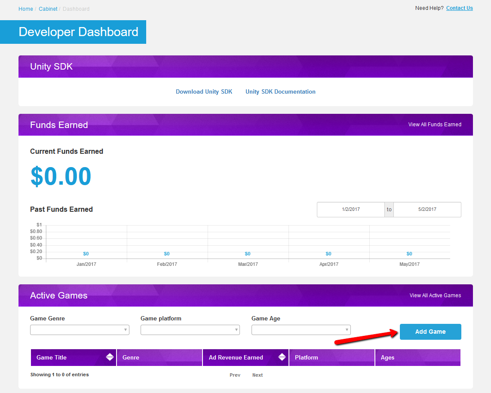

## Setup SDK

There are two main steps: first one related to developer dashboard, and second one to Unity Editor.

**On developer's dashboard:**
1. Register on Trivver website as a developer. Thus you will have access to the developers dashboard.
2. Add new game and set up proper game metadata, and get the game unique identifier.  

**In Unity Editor**
1. Import latest TrivverSDK unity package.
2. Set up Trivver Settings with unique game identifier from above and your login and password.
3. Add [AdSpot](xref:unity-adspot-term to your game and set it's metadata. 
4. Synchronize [AdSpots](xref:unity-adspot-term data with server with Sync Data tool.

Now you are ready to run the game and receive [branded assets](../terms/branded_asset.md).

Now lets take a detailed tour.

### Developer dashboard

1. Go to the link: [https://dashboard.trivver.com/login](https://dashboard.trivver.com/login) 
2. Log in or create new account. While adding new account you also add new organization that will be associated with your account.  
  

3. After login select Developer user type. This will lead you to the Developer's dashboard. This is the place where you can see your current earnings and active games. Also here you can add new game to the Trivver system. Press Add Game to add new game.
  

4. Fill out all the fields and press Save Game. Now, in the Dashboard Active Games section you can see created game.

 
### Trivver Unity SDK

Go to Trivver Settings by pressing ‘Edit Settings’ in Trivver main menu.
The inspector will show ”TrivverSettings”.

[!include]

Enter your login and password and press signin. After successful login you will be able to select the game id (that you've created in dashboard) from dropdown.
Also select current game version. For more information about versions see [Versions and Publishing section](xref:unity-versions)