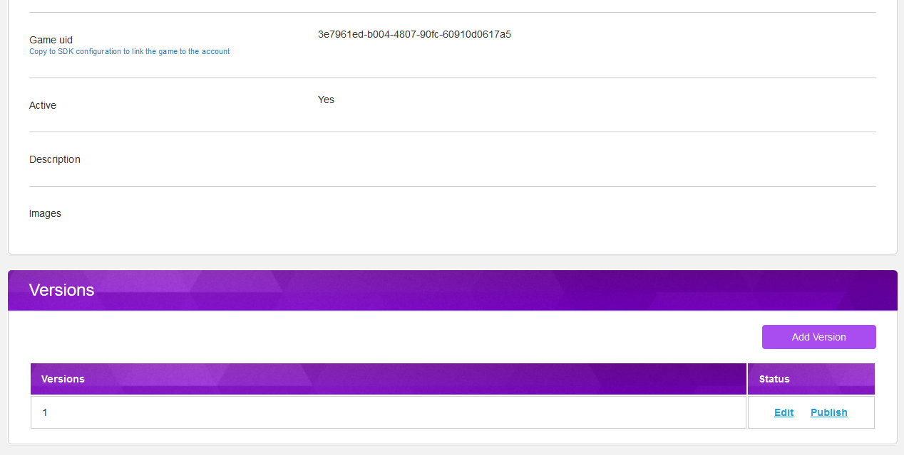
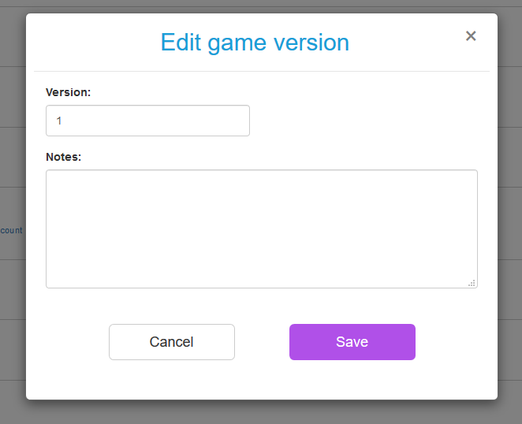

# Versions

When you release your Unity game on any store, it is common to freeze all Trivver configuration \(AdSpot list and categories\) for that release. Otherwise it is possible to break the game for existing users after new synchronization.  
For this purpose we have game versions. You can create new versions in developer dashboard.

Here is the draft workflow for versions:

## How To

After you created a new game, by default new version "1" is added to the game. You can see it in the bottom of the Game page:

  
You can edit it's title \(version itself\) notes and change it's status to published. Also you can add new version.

In Unity sdk Trivver Settings you can select created version as current one:  

When you are ready to publish your game in any store you would like to freeze trivver configuration. Otherwise simple synchronization will lead to wrong data to be loaded to the end users.  
To prevent this you publish the version of the game. Since the version is published you can't make synchronization to this version in Unity editor.  
Instead you will create new version and make any sync with this new version till new release.

